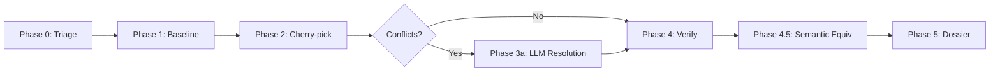

# AI-Based Automatic Performance Analysis & Bug Fix Porting

End-to-end automation for profiling, analyzing, and comparing GPU traces of LLM inference frameworks (vLLM, SGLang, TensorRT-LLM), and for porting security/bug fixes between branches of C/systems projects. Uses Claude as an AI agent with full cost and token tracking.

## Overview

This repository contains two independent AI-powered pipelines:

### 1. GPU Performance Analysis (vLLM / SGLang / TRT-LLM)

Manual analysis of GPU profile traces is labor-intensive, particularly when correlating hundreds of low-level CUDA kernels with high-level Python/C++/CUDA code. This tool automates the entire workflow:

1. **Single-Trace Analysis** — Analyze a single framework's GPU trace to extract transformer block structure, correlate every GPU kernel to its high-level operation, and produce an annotated trace viewable in Perfetto
2. **Cross-Trace Analysis** — Compare two single-trace results (different commits or different frameworks) to identify all performance differences with root cause analysis and optional improvement plans
3. **Profiling** *(optional)* — Run inference benchmarks with GPU profiling and auto-generate analysis configs
4. **Code Generation** *(optional)* — Port optimizations from a faster framework to a slower one

### 2. Bug Fix Porting (CVE / Security / C Systems Projects)

Automated CVE and bug fix backporting pipeline with deterministic git gates, LLM-assisted conflict resolution, and comprehensive analytics. Port security fixes from one branch to another with:

- **Automated triage** — Deterministic git checks (patch-id, ancestry, allowlist) + LLM analysis
- **Strategy rotation** — 3 cherry-pick strategies (default → patience → ort) with automatic fallback
- **Conflict resolution** — LLM-assisted narrow resolution within allowlist scope
- **Build/test verification** — Automated regression testing with allowlist enforcement
- **Semantic equivalence** — Range-diff analysis to verify ported patches match upstream intent
- **Cost tracking** — Per-query token counts and USD costs tracked via Claude Agent SDK
- **Environment validation** — Smart escalation on build failures (distinguishes compiler issues from code issues)

**Key Features:**
- Handles merge commits (auto-resolves to topic branch head)
- Token/cost analytics with JSON export (MLflow-compatible)
- Human-readable dossier generation for review
- Comprehensive flowchart documentation

---

## Table of Contents

- [Examples and Guides](#examples-and-guides)
- [Project Structure](#project-structure)
- [Prerequisites](#prerequisites)
- [Quick Start](#quick-start)
  - [GPU Performance Analysis](#gpu-performance-analysis-1)
  - [Bug Fix Porting](#bug-fix-porting-1)
- [Pipeline Details](#pipeline-details)
  - [GPU Analysis Pipeline](#gpu-analysis-pipeline)
  - [Bug Fix Porting Pipeline](#bug-fix-porting-pipeline)
- [Configuration](#configuration)
- [Analytics & Tracking](#analytics--tracking)
- [Claude Agent Integration](#claude-agent-integration)

---

## Examples and Guides

### GPU Performance Analysis

Detailed guides with copy-pasteable commands are in `auto_analyze/examples/`:

| Guide | Description |
|-------|-------------|
| [Single-Trace Analysis and Annotation](auto_analyze/examples/single_trace_analysis_and_annotation_guide.md) | Analyze a GPU trace and produce an annotated Perfetto visualization |
| [Cross-Commit Comparison](auto_analyze/examples/cross_commit_comparison_guide.md) | Compare two commits of the same framework |
| [Cross-Framework Comparison](auto_analyze/examples/cross_framework_comparison_guide.md) | Compare different frameworks (e.g., vLLM vs SGLang) |
| [vLLM Trace Generation](auto_analyze/examples/vllm_generate_trace_example.md) | How to capture PyTorch profiling traces with vLLM |

Worked examples with full analysis results:

- [Cross-commit example (Kimi-K2.5)](auto_analyze/examples/cross_commit_cmp_example_kimi) — vLLM `main` vs `v0.16.0` on 8xB200, showing a 21.3% improvement from specialized CUDA kernels
- [Cross-framework example (Kimi-K2.5)](auto_analyze/examples/cross_framework_cmp_example_kimi) — vLLM vs SGLang on 8xB200, showing an 8.6% gap driven by MoE dual-stream design differences

### Bug Fix Porting

| Guide | Description |
|-------|-------------|
| [Bug Fix Porting Guide](auto_bug_fix/examples/bug_fix_porting_guide.md) | Complete setup, configuration, pipeline walkthrough, and failure handling |
| [Pipeline Improvements](PIPELINE_IMPROVEMENTS.md) | Build failure handling, escalation logic, environment detection |
| [Comprehensive Flowchart](pipeline-flowchart-detailed.md) | Full phase-by-phase flow with git commands and decision points |

---

## Project Structure

```
ai_auto_perf_analysis/
├── common/                             # Shared utilities
│   ├── claude_utils.py                 #   Claude Agent SDK wrapper with token tracking
│   ├── utils.py                        #   Logging, directory cleanup, output dir helpers
│   └── convert_nsys_to_sqlite.sh       #   NSYS trace format converter
│
├── auto_analyze/                       # GPU Performance Analysis Pipeline
│   ├── run_single_trace.py             #   Single-trace analysis entry point
│   ├── run_cross_trace.py              #   Cross-trace analysis entry point
│   ├── run_chrome_trace.py             #   Chrome trace JSON generation
│   ├── run_summary_pdf.py              #   PDF report generation
│   ├── run_jiras.py                    #   JIRA task creation
│   ├── create_single_trace_config.py   #   Helper: generate single-trace config JSON
│   ├── create_cross_trace_config.py    #   Helper: generate cross-trace config JSON
│   ├── configs/                        #   Config dataclasses and examples
│   │   ├── single_trace_config.py
│   │   ├── single_trace_config_example.json
│   │   ├── cross_trace_config.py
│   │   ├── cross_trace_config_example.json
│   │   └── claude_config.json
│   ├── prompts/                        #   Prompt templates for all analysis steps
│   │   ├── single_trace_prompts.py
│   │   ├── cross_trace_prompts.py
│   │   ├── chrome_trace_prompts.py
│   │   ├── jira_prompts.py
│   │   └── summary_pdf_prompts.py
│   └── examples/                       #   Guides and example runs
│
├── auto_profile/                       # Profiling Orchestration
│   ├── run_profile_core.sh             #   Main profiling script
│   ├── run_profile_summary.py          #   Parse results into analysis configs
│   ├── parse_run_config.py             #   Config parser and validator
│   └── test_configs/                   #   JSON configs (infra, run, docker, GPUs)
│
├── auto_code_gen/                      # AI-Based Code Generation Pipeline
│   ├── run_code_gen.py
│   ├── run_fix_issue.py
│   ├── run_investigate_issue.py
│   ├── run_work_items.py
│   └── run_summary.py
│
├── auto_bug_fix/                       # ⭐ Bug Fix Porting Pipeline
│   ├── bug_fix_config.py               #   BugFixConfig dataclass — repo/branch/commands
│   ├── bug_fix_prompts.py              #   All LLM prompts (Triage, Resolution, Equivalence)
│   ├── run_bug_fix.py                  #   Pipeline orchestrator (Phase 0-5)
│   │
│   ├── tracker.py                      #   Analytics: tokens, cost, timing per phase/query
│   ├── git_tools.py                    #   27 git command wrappers (cherry-pick, patch-id, etc.)
│   ├── patch_id.py                     #   Patch-id computation and forward/backward checks
│   ├── allowlist.py                    #   Seed derivation, rename resolution, enforcement
│   ├── baseline.py                     #   Test suite baseline capture and regression checks
│   ├── range_diff.py                   #   Semantic equivalence via git range-diff
│   ├── dossier.py                      #   Human-readable review dossier generation
│   ├── signature.py                    #   Test failure signature normalization
│   ├── mlflow_export.py                #   Optional MLflow integration
│   │
│   ├── bisect.py                       #   Git bisect with test fixture caching (Phase 1)
│   ├── positive_control.py             #   Positive control validation (unused in current flow)
│   ├── quorum.py                       #   Multi-agent LLM voting (unused in current flow)
│   ├── worktree.py                     #   Git worktree management (future enhancement)
│   │
│   └── examples/
│       └── bug_fix_porting_guide.md    #   Setup and usage guide
│
├── tests/                              # Unit Tests (pytest)
│   ├── auto_bug_fix/
│   │   ├── conftest.py                 #   Test fixtures (git repo, config, stubs)
│   │   ├── test_tracker.py             #   Analytics tracking tests (12 tests)
│   │   ├── test_git_tools.py           #   Git wrapper tests (12 tests)
│   │   ├── test_patch_id.py            #   Patch-id computation tests
│   │   ├── test_allowlist.py           #   Allowlist derivation tests
│   │   ├── test_baseline.py            #   Regression check tests
│   │   ├── test_signature.py           #   Failure signature tests
│   │   ├── test_dossier.py             #   Dossier generation tests
│   │   └── test_quorum.py              #   Quorum voting tests
│   └── ...
│
├── run_case1.py                        # Example: libexpat CVE-2026-45186 pipeline
├── run_case1_container.sh              # Containerized execution (Podman/Docker)
├── Dockerfile.bugfix                   # Container image with build deps
│
├── pipeline-flowchart-detailed.{md,png,svg}  # Full flowchart with git commands
├── pipeline-flowchart-simple.{md,png,svg}    # Simplified flowchart
├── PIPELINE_IMPROVEMENTS.md            # Build failure handling documentation
│
├── env.sh                              # Environment variables
├── run_all.sh                          # Full pipeline orchestrator
└── run_all_scheduled.sh                # Scheduled pipeline execution
```

---

## Prerequisites

### GPU Performance Analysis
- Python 3.10+
- [Claude Agent Python SDK](https://pypi.org/project/claude-agent-sdk/) (`pip install claude-agent-sdk`)
- Framework source code (clean git repos for each framework being analyzed)
- GPU trace files (PyTorch Chrome traces or NSYS traces)

### Bug Fix Porting
- Python 3.10+
- Claude Agent Python SDK (`pip install claude-agent-sdk`)
- Git repository with source and target branches
- Build environment (C/C++ compiler, autotools, etc.)
- Vertex AI authentication (for Claude API via SDK) OR Anthropic API key

**For libexpat example:**
```bash
# Fedora/RHEL
sudo dnf install gcc-c++ autoconf automake libtool docbook2X

# Ubuntu/Debian
sudo apt install g++ autoconf automake libtool docbook2x

# Or use the container (has all deps)
./run_case1_container.sh
```

---

## Quick Start

### GPU Performance Analysis

#### Single-Trace Analysis

Analyze one framework's GPU trace to produce an annotated trace with high-level operation labels:

```bash
# 1. Create the analysis config
python -m auto_analyze.create_single_trace_config \
    --model nvidia/Kimi-K2.5-NVFP4 \
    --gpu-type B200 \
    --batch-size-range 1 \
    --prefill-size-range 4 \
    --output-size-range 1024 \
    --trace-file /path/to/trace.json.gz \
    --run-log-file /path/to/run_log.txt \
    --clean-source-code-path /path/to/vllm \
    --commit-id HEAD \
    --analyze-output-dir /path/to/output \
    --output-config-file /path/to/config

# 2. Run the analysis
python -m auto_analyze.run_single_trace --config /path/to/config.json

# 3. Open the annotated trace in Perfetto
#    -> /path/to/output/single_trace_transformer_block.json
```

#### Cross-Trace Analysis

Compare two single-trace results to identify performance differences:

```bash
# 1. Run single-trace analysis for each commit (see above)

# 2. Create the cross-trace config
python -m auto_analyze.create_cross_trace_config \
    --trace-result-dir /path/to/commit_a/analyze \
    --trace-result-dir /path/to/commit_b/analyze \
    --target-trace-id 0 \
    --analyze-output-dir /path/to/cross_output \
    --output-config-file /path/to/cross_config

# 3. Run the cross-trace analysis
python -m auto_analyze.run_cross_trace --config /path/to/cross_config.json
```

### Bug Fix Porting

#### Option 1: Run Example (libexpat CVE-2026-45186)

```bash
# Clone libexpat
git clone https://github.com/libexpat/libexpat.git ../libexpat

# Run the pipeline
python3 run_case1.py

# View results
cat runs/dossier.md
cat runs/CVE-2026-45186_*.json
```

#### Option 2: Custom Configuration

```bash
# 1. Create your configuration in run_bug_fix.py or a custom script
CONFIG = BugFixConfig(
    repo_path="/path/to/repo",
    build_dir="/path/to/repo/subdir",
    source_branch="v2.8.1",           # Branch with the fix
    target_branch="v2.8.0",           # Branch to port to
    source_fix_commit="9bdfbc77",     # Commit SHA of fix
    bug_description="CVE-2026-45186: quadratic runtime DoS",
    issue_id="CVE-2026-45186",
    build_command="make -j$(nproc)",
    test_command="make check",
)

# 2. Run
python -m auto_bug_fix.run_bug_fix
```

---

## Pipeline Details

### GPU Analysis Pipeline

#### Single-Trace Analysis (`run_single_trace.py`)

Analyzes a single framework's GPU trace through 4 automated steps:

1. **High-level operations** — Reads framework source code to identify the sequence of logical operations in each transformer block type
2. **GPU operations extraction** — Parses the trace file to extract all GPU kernel events with timestamps, streams, and launch parameters
3. **Operation correlation** — Correlates every low-level GPU kernel to its high-level transformer block operation through source code analysis; selects the median block
4. **Annotated trace generation** — Produces a Chrome trace JSON for Perfetto with every kernel labeled with its high-level operation, source code references, and call chain

**Output files:**

| File | Description |
|------|-------------|
| `single_trace_transformer_block.json` | Annotated Chrome trace — open in [Perfetto](https://ui.perfetto.dev) |
| `single_trace_transformer_block.txt` | Human-readable annotated trace summary |
| `transformer_block_high_level_ops.txt` | High-level operation sequence from source code |
| `gpu_ops.txt` | Extracted GPU operations from trace |
| `gpu_ops_to_blocks.txt` | Full correlation of GPU ops to transformer blocks |
| `median_block.txt` | Selected median transformer block |

#### Cross-Trace Analysis (`run_cross_trace.py`)

Compares two or more single-trace results. Automatically detects:
- **Cross-commit** — same framework, different commits (e.g., vLLM v0.16.0 vs main)
- **Cross-framework** — different frameworks, same model (e.g., vLLM vs SGLang)

**Output files:**

| File | Description |
|------|-------------|
| `cross_matching_blocks.txt` | Operation-by-operation matching across traces |
| `cross_compare_blocks.txt` | Performance comparison with root causes and code references |
| `cross_improvement_plan.txt` | *(optional)* Improvement plan with coding guides |

---

### Bug Fix Porting Pipeline

The bug fix porting pipeline runs through **7 phases** with deterministic git gates and LLM assistance:



See **[pipeline-flowchart-detailed.md](pipeline-flowchart-detailed.md)** for the complete flowchart with all git commands and decision points.

#### Phase 0: Triage

**Deterministic gates:**
- Merge commit resolution: `git rev-parse --verify commit^2`
- Seed derivation: `git show --name-only commit`
- Fork point: `git merge-base source_branch target_branch`
- Rename resolution: `git log --follow`, `git diff --find-renames`
- Patch-id: `git show commit | git patch-id --stable`
- Forward check: Search target branch history for matching patch-id
- Ancestry: `git merge-base --is-ancestor commit target`

**LLM analysis:**
- TriageAgent executes all git checks
- Verifies symbol presence via `git grep`
- Identifies vuln-introducing commit via `git blame`
- Writes structured triage report

**Outputs:**
- `triage_report.txt` — Full analysis with all gate decisions
- Dossier entry: Seed files, allowlist, fork point

**Exit conditions:**
- STOP if forward patch-id match found (fix already present)
- PROCEED otherwise

#### Phase 1: Baseline + RED

**Actions:**
1. Checkout target branch: `git checkout target_branch`
2. Build baseline: `./configure && make`
3. Run tests: `make check`
4. Parse failures → `baseline_failures` set

**Smart escalation:**
- Build fails with `compiler`/`configure`/`c++11` keywords → **ESCALATE: Environment Issue**
  - Suggests: `dnf install gcc-c++` or similar
  - Saves tracker + dossier and exits
- Build fails with other error → **ESCALATE: Target Branch Broken**
  - Target should build cleanly
  - Saves tracker + dossier and exits

**Why:** Cannot establish valid baseline for regression testing without successful build.

#### Phase 2: Cherry-pick

**Strategy rotation** (tries in order until success):
1. `git cherry-pick commit` (default)
2. `git cherry-pick -Xpatience commit` (patience)
3. `git cherry-pick -s ort commit` (ort)

**Checks after each:**
- `git status --porcelain` — Look for `UU ` (unmerged) conflicts
- If clean → Record strategy, continue to Phase 4
- If conflicts → Try next strategy
- If all fail and conflicts → Extract conflict files, continue to Phase 3a
- If all fail and unmappable → **ESCALATE**

#### Phase 3a: Narrow LLM Resolution (Conditional)

**Triggered if:** Cherry-pick resulted in conflicts

**Actions:**
1. Re-apply with conflicts: `git cherry-pick -s ort commit`
2. Get fix diff: `git show source_fix_commit`
3. LLM: NarrowResolutionAgent
   - Input: fix_diff, conflicted_files, allowlist
   - Claude edits only conflicted files within allowlist
   - Resolves conflict markers
4. Check: `git status --porcelain` for remaining `UU` lines
5. If resolved: `git add . && git commit --no-edit`

**Outcomes:**
- Resolved → `cp_result = "narrow"`, continue to Phase 4
- Unresolved → Record failure, continue anyway (may still build)

#### Phase 4: Verify

**Gates (all must pass):**

1. **Build:** `./configure && make`
   - If fails with same error as baseline → Note as environment issue
   - If fails with new error → CRITICAL (patch broke build)

2. **Tests:** `make check`
   - Parse `post_failures` set

3. **Regression:** `post_failures ⊆ baseline_failures`
   - Check for new failures introduced by patch
   - Records gate: `regression=passed` or `regression=new:list`

4. **Allowlist:** `git diff --name-only HEAD^..HEAD`
   - All changed files must be in allowlist (from Phase 0)
   - Records gate: `allowlist=passed` or `allowlist=violations:files`

**Build failure handling:**
```python
if post_build_failed:
    if same_error_as_baseline:
        → NOTE: Environment issue (not patch fault)
    else:
        → CRITICAL: Patch broke build
        → gate: patch_breaks_build=yes
```

#### Phase 4.5: Semantic Equivalence

**Actions:**
1. Run range-diff: `git range-diff source^..source HEAD^..HEAD`
2. Parse equivalence: `identical`, `similar`, or `modified`
3. If not identical:
   - Get patches: `git show source_fix`, `git format-patch HEAD^`
   - LLM: SemanticEquivalenceAgent
     - Analyzes differences
     - Votes: `equivalent`, `equivalent with modifications`, or `not equivalent`

**Purpose:** Verify ported patch semantically matches upstream intent, even if not byte-identical.

#### Phase 5: Dossier

**Actions:**
1. Build commit trailers:
   ```
   AutoBugFix-Phase: clean|narrow|conflict
   AutoBugFix-Model: claude-sonnet-4-6
   AutoBugFix-Run-ID: <uuid>
   ```
2. Generate patch: `git format-patch HEAD^..HEAD`
3. Compute rollups (total tokens, cost, duration)
4. Save tracker JSON: `runs/CVE-ID_timestamp.json`
5. Write dossier markdown: `runs/dossier.md`
6. Print summary table

**Outputs:**
- Tracker JSON with full telemetry
- Dossier markdown for human review
- Candidate patch ready to merge

---

## Configuration

### Bug Fix Pipeline Configuration

Edit the `BugFixConfig` in your script:

```python
CONFIG = BugFixConfig(
    # Repository paths
    repo_path="/path/to/repo",               # Git repo path
    build_dir="/path/to/repo/subdir",        # Where to run build commands
    
    # Git references
    source_branch="v2.8.1",                  # Branch with the fix
    target_branch="v2.8.0",                  # Branch to port to
    source_fix_commit="abc123",              # Fix commit SHA
    
    # Metadata
    bug_description="CVE-XXXX: description", # Bug/CVE description
    issue_id="CVE-XXXX",                     # Issue ID for tracking
    
    # Build & test commands
    build_command="make -j$(nproc)",         # Build command
    test_command="make check",               # Test command
    
    # Optional: Advanced settings
    max_build_test_retries=3,
    bisect_max_commits=50,
    forward_patch_id_lookback="12 months",
    allowlist_rename_expansion_cap=3,
)
```

### Claude Configuration

```python
CLAUDE_CONFIG = ClaudeConfig(
    model="claude-sonnet-4-6",          # Model selection
    allowed_tools=["Read", "Write", "Bash"],
    perm_mode="acceptEdits",            # Auto-accept edits
    cwd="/path/to/output",              # Working directory
)
```

---

## Analytics & Tracking

### Token & Cost Tracking

Every LLM query is tracked with:
- **Input tokens** (including cache reads)
- **Output tokens**
- **Duration** (wall time + API time)
- **Cost in USD** (computed from model pricing)

**Extraction from Claude Agent SDK:**
```python
# ResultMessage.model_usage[model_name]
{
    "inputTokens": 985,
    "outputTokens": 15869,
    "cacheReadInputTokens": 742561,
    "costUSD": 0.2410
}
```

**Pricing (per 1M tokens):**
| Model | Input | Output |
|-------|-------|--------|
| claude-opus-4-6 | $15.00 | $75.00 |
| claude-opus-4-7 | $15.00 | $75.00 |
| claude-sonnet-4-6 | $3.00 | $15.00 |
| claude-haiku-4-5 | $0.80 | $4.00 |

### Tracker JSON Output

```json
{
  "run_id": "b59b2813",
  "issue_id": "CVE-2026-45186",
  "start_time": "2026-05-28T15:08:22Z",
  "total_duration_s": 341.0,
  "total_cost_usd": 0.2442,
  "total_queries": 2,
  "total_input_tokens": 18223,
  "total_output_tokens": 17276,
  "outcome": "success",
  "phases": [
    {
      "phase": "Phase 0 — Triage",
      "duration_s": 301.8,
      "gate_decisions": {
        "allowlist_files": "1",
        "forward_patch_id": "not_found",
        "ancestry": "not_ancestor"
      },
      "queries": [
        {
          "prompt_name": "TriageAgent",
          "duration_s": 300.4,
          "input_tokens": 985,
          "output_tokens": 15869,
          "cost_usd": 0.2241
        }
      ]
    }
  ]
}
```

### Example Output

From the successful libexpat run:

```
Phase                                 Duration  Queries       Tokens       Cost
----------------------------------- ---------- -------- ------------ ----------
Phase 0 — Triage                        301.8s        1       15,723 $   0.2241
  -> query_1                             300.4s                15,723 $   0.2241
  Gates: allowlist_files=1, forward_patch_id=not_found, ancestry=not_ancestor
Phase 1 — Baseline + RED                 11.0s        0            0 $   0.0000
  Gates: baseline_build=passed, baseline_tests=exit=0,failures=0
Phase 2 — Cherry-pick                     0.1s        0            0 $   0.0000
  Gates: cherry_pick=clean:default
Phase 4 — Verify                          7.9s        0            0 $   0.0000
  Gates: post_patch_build=passed, regression=passed, allowlist=passed
Phase 4.5 — Semantic equivalence         20.2s        1        2,500 $   0.0201
  -> query_1                              19.9s                 2,500 $   0.0201

----------------------------------- ---------- -------- ------------ ----------
TOTAL                                   341.0s        2       18,223 $   0.2442
```

### MLflow Export (Optional)

```python
from auto_bug_fix.mlflow_export import export_to_mlflow
from auto_bug_fix.tracker import PipelineRun
import json

# Load tracker JSON
with open("runs/CVE-2026-45186_*.json") as f:
    run_data = json.load(f)
    run = PipelineRun(**run_data)

# Export to MLflow
mlflow_run_id = export_to_mlflow(run, "runs/CVE-2026-45186_*.json")
```

---

## Claude Agent Integration

All AI-driven steps use the Claude Agent SDK via `common/claude_utils.py`:

| Parameter | Value |
|-----------|-------|
| Model | `claude-opus-4-6[1m]` (GPU) / `claude-sonnet-4-6` (Bug Fix) |
| Allowed tools | `Read`, `Write`, `Bash` |
| Permission mode | `acceptEdits` |
| Thinking mode | Adaptive |
| Effort | Max |

### Token Extraction

```python
async def claude_run(config, prompts, tracker=None):
    # ... SDK query ...
    async for msg in client.receive_response():
        if isinstance(msg, ResultMessage):
            # Extract from model_usage (camelCase keys)
            model_stats = msg.model_usage[config.model]
            input_tokens = model_stats["inputTokens"]
            output_tokens = model_stats["outputTokens"]
            
            if tracker:
                tracker.record_query(
                    prompt_name,
                    start_time, end_time,
                    input_tokens=input_tokens,
                    output_tokens=output_tokens,
                )
```

---

## Testing

### Unit Tests

```bash
# Run all tests
python -m pytest tests/

# Run specific module
python -m pytest tests/auto_bug_fix/test_tracker.py -v

# Run with coverage
python -m pytest tests/ --cov=auto_bug_fix --cov-report=html
```

**Test coverage:**
- `test_tracker.py` — 12 tests (analytics tracking, cost computation, rollups)
- `test_git_tools.py` — 12 tests (git wrappers, merge resolution)
- `test_patch_id.py` — 3 tests (patch-id computation, forward/backward checks)
- `test_allowlist.py` — 6 tests (seed derivation, rename resolution, enforcement)
- `test_baseline.py` — 4 tests (baseline capture, regression checks)
- `test_signature.py` — 6 tests (failure signature normalization, comparison)
- `test_dossier.py` — 4 tests (dossier generation, trailers)
- `test_quorum.py` — 3 tests (multi-agent voting)

**Total: 70+ passing tests**

---

## Logging

All pipeline steps log to `logs/run_{step_name}.log` with simultaneous stdout output.

### GPU Analysis Logs

| Step | Log file |
|------|----------|
| Single-trace analysis | `logs/run_single_trace.log` |
| Cross-trace analysis | `logs/run_cross_trace.log` |
| Summary PDF | `logs/run_summary_pdf.log` |
| Chrome trace | `logs/run_chrome_trace.log` |
| JIRA creation | `logs/run_create_jiras.log` |

### Bug Fix Porting Logs

Logs to stdout with Python logging:
```python
import logging
logging.basicConfig(
    level=logging.INFO,
    format="%(asctime)s %(levelname)s %(message)s"
)
```

---

## Exit Conditions

The bug fix porting pipeline has **4 possible outcomes**:

| Outcome | Trigger | Saved Files | User Action |
|---------|---------|-------------|-------------|
| **SUCCESS** | All phases pass | Tracker JSON<br/>Dossier MD<br/>Candidate patch | Review & merge |
| **STOP** | Forward patch-id match | Tracker JSON<br/>Dossier MD | None (fix already present) |
| **ESCALATE:<br/>Environment** | Baseline build fails<br/>(compiler/configure error) | Tracker JSON<br/>Dossier MD | Fix environment<br/>(install compiler) |
| **ESCALATE:<br/>Target Broken** | Baseline build fails<br/>(code issue) | Tracker JSON<br/>Dossier MD | Fix target branch |
| **ESCALATE:<br/>Unmappable** | All cherry-pick<br/>strategies fail | Tracker JSON<br/>Dossier MD | Manual port required |

---

## Contributing

See the individual module docstrings and test files for implementation details. Key design principles:

1. **Deterministic gates first** — Git commands are source of truth, LLM validates
2. **Narrow scope for LLM** — Only resolve conflicts, don't redesign the fix
3. **Cost tracking** — Every query recorded with tokens and USD cost
4. **Fail fast** — Escalate on environment issues rather than producing false positives
5. **Comprehensive testing** — 70+ unit tests covering all modules

---

## License

[Add your license here]

## Contact

[Add contact information]
